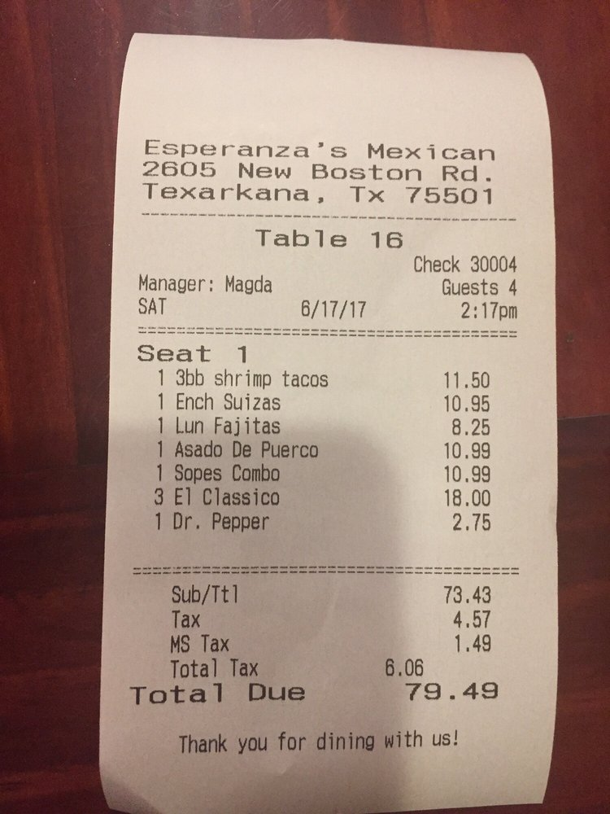

# Buddy Bill
Created by Da Sol Lee & Greta Yu

## Table of Contents
1. [Overview](#Overview)
2. [Product Spec](#Product-Spec)
3. [Wireframes](#Wireframes)
4. [Networking](#Networking)
5. [Video Walkthrough](#Video-Walkthrough)

## Overview
### Description
Buddy Bill provides a convenient way to split a bill among friends. 
Snap a picture of the receipt and tap your items to claim them. 
This iOS app will generate what each person will pay, including the tax and tip.

### Current Limitations
- Can only process english receipts
- Does not handle currency symbols
- Receipt readings are not always accurate

### App Evaluation
- **Category:** Social/Finance
- **Mobile:** This app is developed for mobile devices but would be just as viable on a computer. 
- **Story:** Users take a picture of their receipt. Each person can select the items that they ordered, and multiple people can select the same item if they shared it. The tax and tip are divided proportionally. A new 'bill' is generated indicating what each person will pay.
- **Market:** Anyone who needs to split the bill! 
- **Habit:** App usage depends on how often a user needs to split bills with others.
- **Scope:** Large potential to become widely used like Venmo and traditional calculators!

## Product Spec
### 1. User Stories (Required and Optional)
**Required Must-have Stories**
- [x] User can take a picture of the receipt and generate the list of items
- [x] User can set tax and tip
- [x] User can enter names of people who are splitting the bill
- [x] User can select which items each person ordered
- [x] The bill will be displayed with each person’s name and total.

**Optional Nice-to-have Stories**
- [ ] Venmo integration
- [ ] Saved user profiles
- [ ] History of past transactions
- [ ] Delete items
- [ ] User can select a photo from their gallery or use their camera
- [ ] Allows user to modify the receipt items

### 2. Screen Archetypes
* Start Screen
    * Allows user to take a picture of a receipt 
* Calculation Screen
    * What the user sees as we extract receipt items
* Confirmation Screen
    * User can optionally add tax and tip
* Buddy Addition Screen
    * Asks user for names of friends
* Selection Screen
    * Select which items each person ordered
* Bill Calculation Screen
    * What the user sees as we calculate the final bill
* Results Screen
    * Displays name of each person and amount they need to pay
    * User can process another receipt

### 3. Navigation
**Tab Navigation** (Tab to Screen)
* Receipt Processing (optional)
* User Profile (optional)

**Flow Navigation** (Screen to Screen)
* Start Screen
    * Scan Receipt Button -> Lens / Gallery -> Calculation Screen
* Calculation Screen -> Confirmation Screen
* Confirmation Screen
    * (optional) Scan Again Button -> Lens / Gallery -> Confirmation Screen
    * Looks Good Button -> Buddy Addition Screen
* Buddy Addition Screen
    * Done Button -> Selection Screen
* Selection Screen
    * Done -> Moves to next person
    * If all friends have selected (last person clicks done) -> Bill Calculation Screen
* Bill Calculation Screen -> Results Screen
* Results Screen
    * Scan Again Button -> Start Screen

## Wireframes
Note: Our app has been altered from the wireframe during development

## Networking
### APIs
We are using the Taggun API to parse receipts for information.
We are disabling the API Key because we do not want to get charged. 
You can request a free trial key on Taggun's website.
[https://www.taggun.io/help](https://www.taggun.io/help)

Base URL - ["https://api.taggun.io]("https://api.taggun.io)

   HTTP Verb | Endpoint | Description
   ----------|----------|------------
    `POST`    | /api/receipt/v1/verbose/file | transcribe a receipt by uploading an image file and return detailed result
  
  ## Video Walkthrough
  
  
